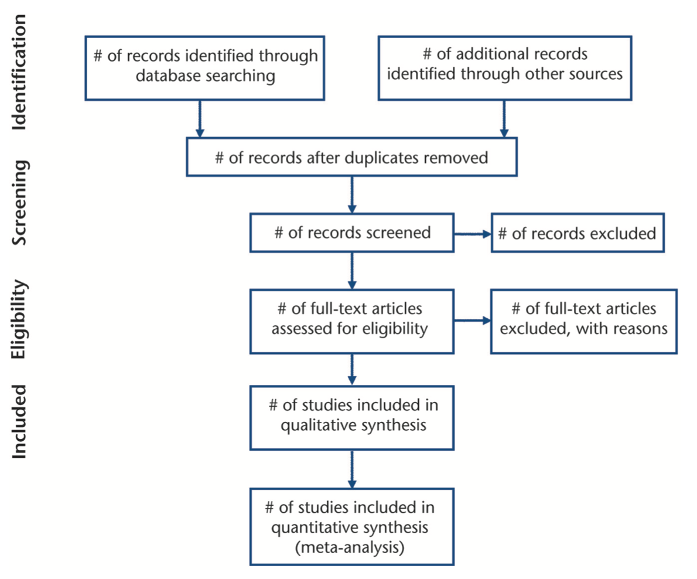
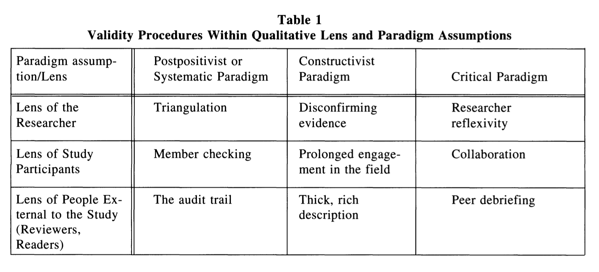
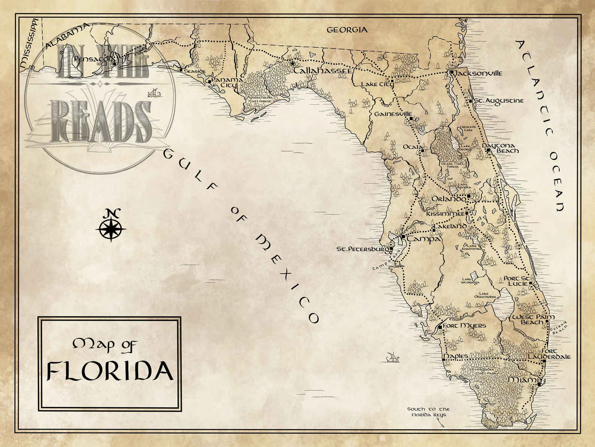

```{r setup, include=FALSE}
usethis::use_git_ignore(c("*.csv", "*.rds"))
options(htmltools.dir.version = FALSE)

library(knitr)
library(tidyverse)
library(xaringan)
library(fontawesome)
```


class: inverse, center, middle

# `r fa("fas fa-images", fill = "#fff")`

**View the slides:** 

[bretsw.com/eme6665-ss26-module2](https://bretsw.com/eme6665-ss26-module2)


---

class: inverse, center, middle

# `r fa("far fa-comments", fill = "#fff")` <br><br> Module 1 <br> Recap

---

# `r fa("far fa-comments", fill = "#fff")` Keep Calm

```{r, out.width = "720px", echo = FALSE, fig.align = "center"}
include_graphics("img/calm.jpg")
```

---

# `r fa("far fa-comments", fill = "#fff")` Get Organized

```{r, out.width = "720px", echo = FALSE, fig.align = "center"}
include_graphics("img/tidy.jpg")
```

---

# `r fa("far fa-comments", fill = "#fff")` Write Topic Sentences

```{r, out.width = "720px", echo = FALSE, fig.align = "center"}
include_graphics("img/start.jpg")
```

---

# `r fa("far fa-comments", fill = "#fff")` Use Theory to Spotlight

```{r, out.width = "720px", echo = FALSE, fig.align = "center"}
include_graphics("img/streetlamp.jpg")
```

---

# `r fa("far fa-comments", fill = "#fff")` Ask for Help

```{r, out.width = "720px", echo = FALSE, fig.align = "center"}
include_graphics("img/interview.jpg")
```

---

# `r fa("far fa-comments", fill = "#fff")` Take A Break

```{r, out.width = "720px", echo = FALSE, fig.align = "center"}
include_graphics("img/self-directed.jpg")
```


---

class: inverse, center, middle

# `r fa("fas fa-handshake", fill = "#fff")` <br><br> Module 2: <br> Do You Trust Me?

---

# `r fa("fas fa-handshake", fill = "#fff")` News Literacy

```{r, out.width = "720px", echo = FALSE, fig.align = "center"}

```

<div class="caption">
<p><a href="https://newslit.org/tips-tools/how-news-literate-are-you-quiz/" target="_blank">How News Literate Are You? (quiz)</a></p>
</div>

---

# `r fa("fas fa-filter", fill = "#fff")` Screening Articles

```{r, out.width = "420px", echo = FALSE, fig.align = "center"}
include_graphics("img/filter.jpg")
```

--

**Practical screening:** (Fink, 2020)

--

- Publication date: **Mostly year ≥ 2021** (within the past 5 years, but some foundational too)

--

- Source: Peer-reviewed journal articles

--

  - High quality journals: Indexed, **impact factor ≥ 1.0**, not pay-to-publish

--

  - See FSU Libraries' [Academic Publishing Guide](https://guides.lib.fsu.edu/academicpublishing/citationanalysis))

---

# `r fa("fas fa-filter", fill = "#fff")` Screening Articles

```{r, out.width = "420px", echo = FALSE, fig.align = "center"}
include_graphics("img/filter.jpg")
```

**Methodological screening:** (Fink, 2020)

--

- Population and setting

--

- Date of data collection

--

- Paradigm and methodology

--

- Evidence supporting claims (trustworthiness, validity, reliability)


---

class: inverse, center, middle

# `r fa("book-open", fill = "#fff")` <br><br> Module 2 readings

---

# `r fa("book-open", fill = "#fff")` Module 2 readings

```{r, out.width = "500px", echo = FALSE, fig.align = "center"}
include_graphics("img/reading.jpg")
```

--

- 2.1 Searching and Screening: The Practical Screen and Methodological Quality (Fink, 2020, Chapter 2)

--

- 2.2 A Guide for the Perplexed: Scientific Educational Research, Methodolatry, and the Gold Versus Platinum Standards (Phillips, 2006)

--

- 2.3 Standards for Reporting on Empirical Social Science Research in AERA Publications (AERA, 2006)

---

# `r fa("book-open", fill = "#fff")` Module 2 readings

```{r, out.width = "500px", echo = FALSE, fig.align = "center"}
include_graphics("img/reading.jpg")
```

- 2.4 Preferred Reporting Items for Systematic Reviews and Meta-Analyses: The PRISMA Statement (Moher et al., 2009)

--

- 2.5 Determining Validity in Qualitative Inquiry (Creswell & Miller, 2000)

--

- 2.6 Collaboration, Multiple Methods, Trustworthiness: Issues Arising from the 2014 International Conference on Self-study of Teacher Education Practices (Mena & Russell, 2017)

---

# PRISMA Standards

```{r, out.width = "600px", echo = FALSE, fig.align = "center"}

```

<div class="caption">
<p>(Moher et al., 2009)</p>
</div>

---

# Creswell & Miller (2000)

```{r, out.width = "100%", echo = FALSE, fig.align = "center"}

```

<div class="caption">
<p>(Creswell & Miller, 2000)</p>
</div>


---

class: inverse, center, middle

# `r fa("fas fa-binoculars", fill = "#fff")` <br><br> Looking ahead

---

# `r fa("fas fa-calendar-day", fill = "#fff")` Semester schedule

```{r, out.width = "280px", echo = FALSE, fig.align = "center"}
include_graphics("img/reading.jpg")
```

- **Module 1:** Threads of Chapter One

- **Module 2: Do You Trust Me?**

- **Module 3:** Systematic Not Automatic

- **Module 4:** Synthesis Over Summary

- **Module 5:** Elements of Style (for Academic Writing)

- **Module 6:** Weaving Together Chapter One

- **Module 7:** Beauty is in Revision

---

# `r fa("fas fa-calendar-day", fill = "#fff")` Major Assignments

```{r, out.width = "260px", echo = FALSE, fig.align = "center"}
include_graphics("img/build.jpg")
```

`r fa("fas fa-keyboard", fill = "#782F40")` **Assignments** (70%)

- Module 1 Assignment: Research Map (100 points)

- **Module 2 Assignment: Introduction Section (100 points)**

- Module 3 Assignment: Research Outline (100 points)

- Module 4 Assignment: First Completed Subsection (100 points)

- Module 5 Assignment: Second Completed Subsection (100 points)

- Module 6 Assignment: Chapter One Draft One (100 points)

- Module 7 Assignment: Chapter One Draft Two (100 points)

---

# `r fa("fas fa-keyboard", fill = "#fff")` Introduction Section

--

### Write the (brief) opening to your prospectus

<hr>

--

- Research Topic (Implied)

--

- Problem

--

- Purpose

--

<hr>

### Your main objective is to get your reader interested!

```{r, out.width = "360px", echo = FALSE, fig.align = "center"}

```


---

class: inverse, center, middle

# `r fa("fas fa-question", fill = "#fff")` <br><br> Questions

<hr>

**What questions can I answer for you now?**

**How can I support you this week?**

<hr>

`r fa("envelope", fill = "#fff")` [bret.staudtwillet@fsu.edu](mailto:bret.staudtwillet@fsu.edu) | `r fa("globe", fill = "#fff")` [bretsw.com](https://bretsw.com) | `r fa("fab fa-github", fill = "#fff")` [GitHub](https://github.com/bretsw/)